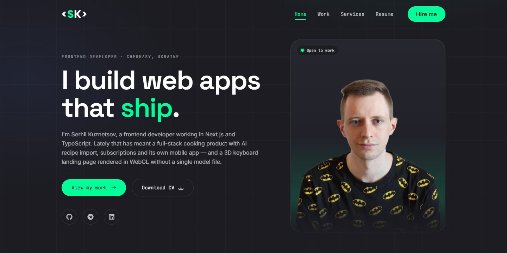

# Serhii Kuznetsov — portfolio

My personal site: the projects I have built, a case study for each one that has a real story
behind it, and a way to get in touch.

**[sk-portfilio.vercel.app](https://sk-portfilio.vercel.app)**

**Next.js 15 · React 19 · TypeScript · Tailwind CSS v3 · Framer Motion**



## What is on it

| Route | What it shows |
| --- | --- |
| `/` | Hero, counters and the featured projects |
| `/work` | Every project with category filters; older, smaller ones in a compact "Earlier work" list |
| `/work/[slug]` | Case studies — the problem, the decisions it forced, what was measured — generated statically |
| `/services` | What I offer, each item linked to the project where I have already done it |
| `/resume` | Experience, skills and education, plus the CV as a PDF |
| `/contacts` | A three-field form and the direct channels |

## The decisions worth defending

**One list of projects feeds everything.** [`data/projects.ts`](data/projects.ts) drives the home
page, the work page, the case-study routes, the sitemap, the proof links on `/services` and the
counters. A project cannot show one stack on the home page and another on `/work`, and the
counters cannot claim more projects than the site actually lists — they are counted, not typed in.

**Case studies only where there is a story.** [`data/case-studies.ts`](data/case-studies.ts) has
entries only for projects with something worth writing up; the rest fall back to their highlights.
A case study padded with invented detail is worse than none.

**No link that leads to a 404.** Several of the repositories are private. Rather than a GitHub
button a visitor can only open to an error page, those cards show a lock and the case study says
so.

**Server components by default.** Project cards, the services, the resume and the case studies
render on the server, and hover effects are CSS transitions. Client code is limited to what needs
the browser: the work filter, scroll reveals, the page transition, the counters, the contact form
and the navigation.

**Metadata for every page, including the client ones.** The root layout's canonical is `/`, and a
`"use client"` page cannot export metadata — so `/work`, `/resume` and the rest used to inherit it
and tell search engines they were duplicates of the home page. Each of those segments now has a
server `layout.tsx` calling `pageMetadata()` from [`lib/metadata.ts`](lib/metadata.ts).

## Three bugs worth remembering

**`backdrop-filter` was the lag.** Measured in a headed Chrome on a 165 Hz display — headless
Chrome renders at 60 fps whatever the monitor, so it cannot see this — the worst frame while
scrolling was 146 ms with blurred cards and header, 12 ms without. The blur became more opaque
surfaces, and `blur-3xl` glows became radial gradients.

**`AnimatePresence mode="wait"` blanked whole pages.** In the App Router, a navigation that
interrupted the old page's fade-out left the wrapper stuck at `opacity: 0`: header and footer on
screen, content invisible. On production that happened on 30 of 40 navigations. There is now no
exit animation at all; the entrance is keyed on the pathname and can only animate towards visible.
Searching for this with `innerText` finds nothing — the text is there at zero opacity — so it has
to be measured as computed opacity.

**A counter that reset "4 years" to "0".** react-countup's scroll spy started the first counter
on mount instead of on scroll, never marked it as done, and reset it as soon as it scrolled out of
view. It was replaced with a small counter on Framer Motion's `useInView`, the same mechanism the
scroll reveals use.

## Project structure

```
app/                  routes; layout.tsx files carry metadata for client pages
  work/[slug]/        case-study pages, one per entry in data/projects.ts
  opengraph-image.tsx social preview card, generated at build time
components/           ProjectCard, Reveal, Stats, ContactForm, EarlierWork, …
data/
  projects.ts         every project, newest first
  case-studies.ts     long-form notes, keyed by project slug
  resume.ts           experience, skills and education
lib/
  site.ts             name, role, contacts, CV path, canonical URL
  metadata.ts         per-page title, canonical and Open Graph
public/assets/        portrait, project screenshots, the CV
```

## Adding a project

1. Put a screenshot in `public/assets/work/`.
2. Add an entry to the top of `projects` in [`data/projects.ts`](data/projects.ts) — newest first,
   with anything marked `archived: true` kept at the end. For a private repository use
   `github: null` with a `sourceNote`; with nothing live to link to, `live: null` with a
   `linkNote`. `featured: true` puts it on the home page.
3. Optionally, write a case study under the same slug in
   [`data/case-studies.ts`](data/case-studies.ts).

The `/work/<slug>` page, the sitemap entry, the filter chip and the counters follow on their own.

## Running it

```bash
npm install
npm run dev          # http://localhost:3000, with Turbopack
npm run typecheck
npm run lint
npm run build
```

`typecheck`, `lint` and `build` all have to pass before a push to `master`, which Vercel deploys.
Vercel installs with `npm ci`, so `package-lock.json` must stay in step with `package.json`.

`NEXT_PUBLIC_SITE_URL` sets the canonical origin; without it the site uses Vercel's
`VERCEL_PROJECT_PRODUCTION_URL`, and `http://localhost:3000` locally. The contact form posts to
Formspree — the endpoint is in [`components/ContactForm.tsx`](components/ContactForm.tsx).
